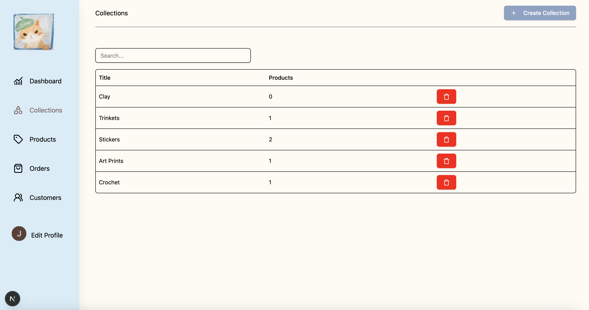
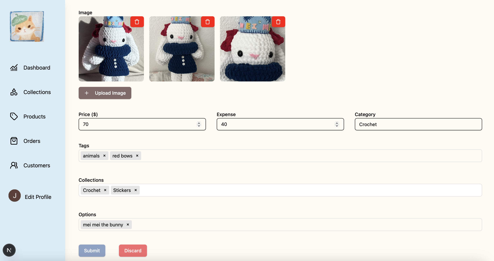
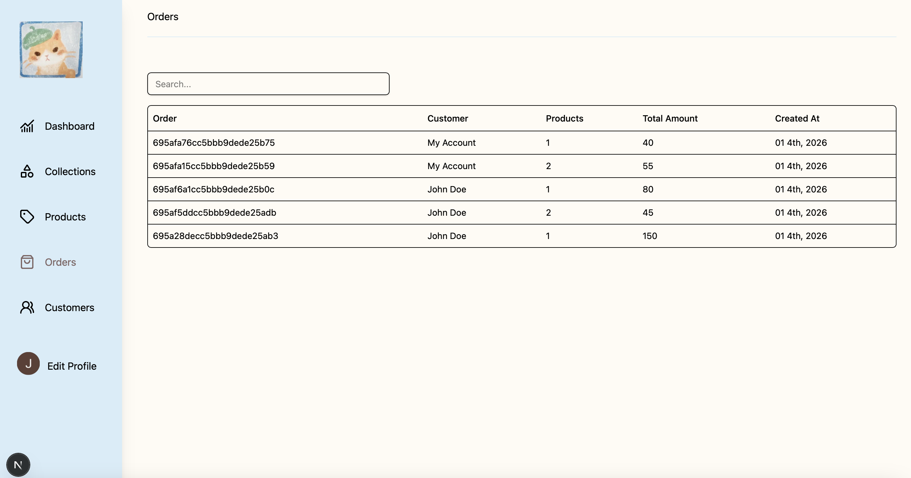

## PastelPixels Admin
Admin dashboard for Pastel Pixels store.

### Features 
- Collection creation and deletion: upload title, description, and cover image
- Product creation and deletion: upload title, description, images, collection, price, tags, and options
- Orders: check order number, products ordered. Upon clicking order number, takes you to more detailed page about shipping address, shipping type, and all products ordered
- Customers

### Built with
TypeScript
- Framework: Next.js
- Backend: Next.js API routes
- Database: MongoDB with Mongoose 
- Authentication: Clerk
- Frontend: React, Tailwind CSS
- UI components: Shadcn, Lucide 
- Design: Fully designed by myself

### Usage

```bash
npm run dev -- --experimental-https
```

### Screenshots




